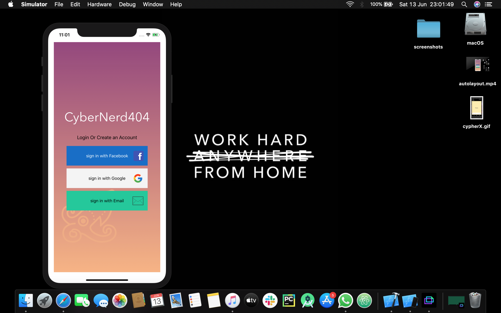
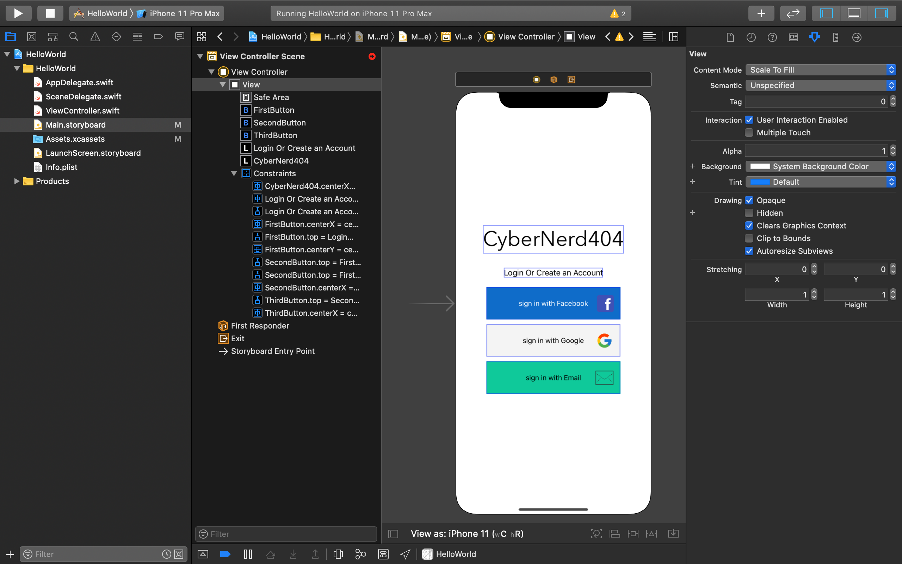

# LoginUI_ios_app

# Learing iOS Development and created login screen using storyboard.

     
     
  

## Built With 🛠
- [Swift](https://swift.org) - Swift is a general-purpose programming language built using a modern approach to safety,
                                  performance, and software design patterns..
